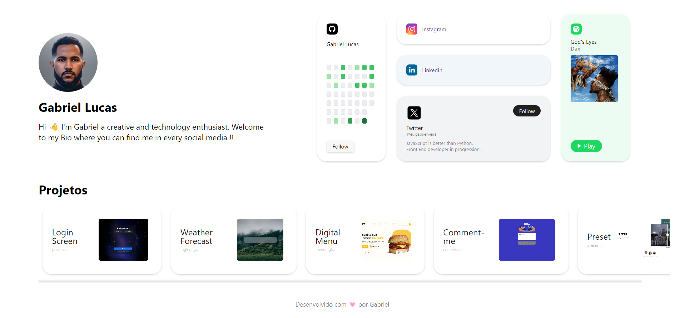
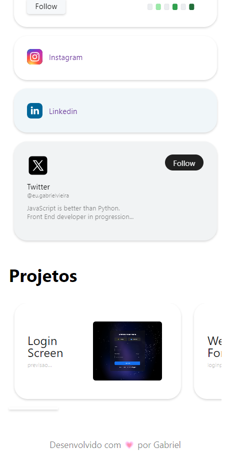

# Pagina de Links

Criei esse projeto para testar meus conhecimentos e descobrir que posso muito quando quero.

Decidi fazer esse projeto pois vi em um link de um perfil de instagram ai decide fazer incomporando animações e o que eu sei de javascript, html e css.

Alem disso foi utilizado a tag [audio] para colocar uma música com as ações de play e pause.

<div class="thumbnail" style="margin-bottom: 10px">
    <h1 style="text-align: center">Desktop</h1>
    
    <h1 style="text-align: center">Mobile</h1>
    <div style="width: 100%; display:flex; gap:2px; flex-direction: row; align-items: center; justify-content: center;">
        
        
    </div>

</div>

[](https://linksaqui.netlify.app/)

## Feito com


### Fique a vontade para copiar esse codigo e inserir em seu projetos, Lembrando que:

Para clonar o projeto siga os passos abaixo:

1 - Abra o Terminal (ou o Git Bash no Windows):
Abra o terminal ou o Git Bash, dependendo do seu sistema operacional.

2 - Navegue para o Diretório onde Deseja Clonar o Repositório:
Use o comando cd para navegar para o diretório onde deseja que o repositório seja clonado. Por exemplo:

```
cd pasta/onde/quero/clonar
```

3 - Navegue com o seguinte diretório:

```
git clone https://github.com/DevGabriel0402/linksUteis.git
```

4 - Clone o Repositório:
Use o comando git clone seguido do URL que você copiou anteriormente. Se você estiver usando HTTPS, será algo assim:

```
git clone https://github.com/DevGabriel0402/linksUteis.git
```

Se você estiver usando SSH, será algo assim:

```
git clone git@github.com:DevGabriel0402/linksUteis.git
```

5 - Pressione Enter:
Pressione Enter para executar o comando. O Git irá então baixar todos os arquivos do repositório para o diretório local que você especificou.

### Parabéns! Clonou o repositório com Sucesso.

Após executar esses passos, você terá uma cópia local do meu repositório em seu computador, pronto para ser usado e modificado conforme necessário.
